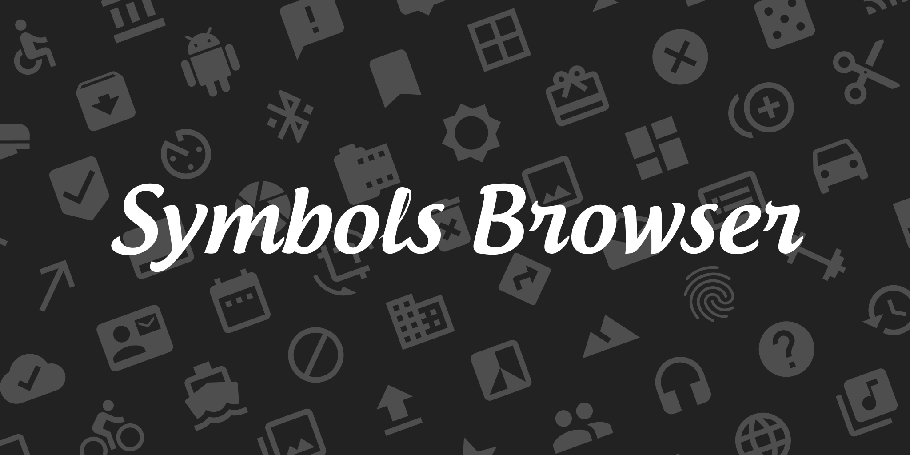

Symbol Icons Browser makes it easy to browse and copy symbols from SF Symbols & Material Icons font.

To use this plugin, Please install San Francisco font and Material Icons font (.ttf).

- San Francisco font: [Apple Fonts](https://developer.apple.com/fonts/)
- Material Icons font (.ttf): [Material Design Icons](https://github.com/google/material-design-icons)
Symbol Icons Browser makes it easy to browse and copy symbols from SF Symbols & Material Icons font.

# Ready to use
To use this plugin, Please install San Francisco font and Material Icons font (.ttf).

San Francisco font: https://developer.apple.com/fonts/
Material Icons font (.ttf): https://github.com/google/material-design-icons

# Usage
1. Find the symbol you want to use
2. Click the symbol

# Click Options
- Copy: copy symbol glyph to clipboard
- Copy&Paste: copy and paste symbol glyph to selected text objects
- Create: create new symbol glyph as a text object on the canvas